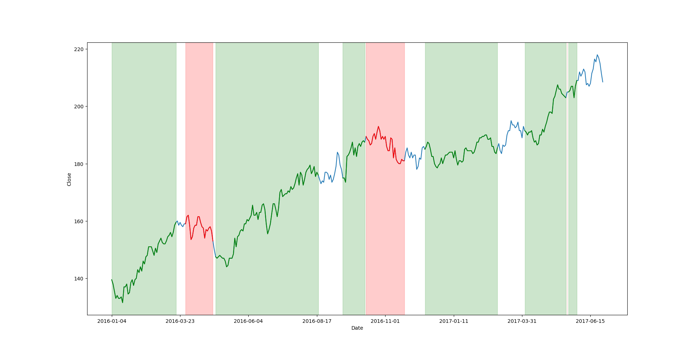

# cnn-trend-classifier

- data/ 為訓練資料存放位置

## 訓練模型

不使用 GAF
```
python -m src.train -c data/data.csv -w 15 -m test.keras
```

使用GAF
```
python -m src.train_gaf -c data/data.csv -w 15 -m test.keras
```

## 載入模型

```
python -m src.classifier -c data/data.csv -m models/best.keras -w 20 -l 180
```

## 分類結果


